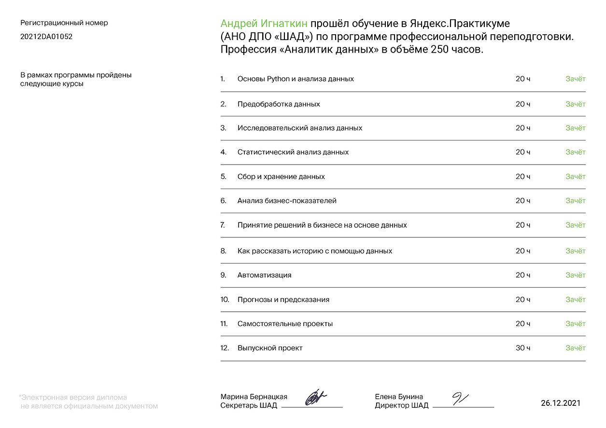

## Данные проекты были выполнены в ходе обучения в Яндекс.Практикум профессии "Аналитик данных"

Ссылка на курс: https://praktikum.yandex.ru/data-analyst/

| Название проекта | Описание | Навыки и инструменты |
| :----------------| :---------------------  | :---------------------------- |
|[1. Исследование надёжности заёмщиков — анализ банковских данных](1.%20Исследование%20надёжности%20заёмщиков)|На основе данных кредитного отдела банка исследовал влияние семейного положения и количества детей на факт погашения кредита в срок. Была получена информация о данных. Определены и обработаны пропуски. Заменены типы данных на соответствующие хранящимся данным. Удалены дубликаты. Выделены леммы в значениях столбца и категоризированны данные|предобработка данных, Python, Pandas, PyMystem3, лемматизация|
|[2. Продажа квартир в Санкт-Петербурге — анализ рынка недвижимости](12.%20Анализ%20рынка%20недвижимости)|На основе данных сервиса Яндекс.Недвижимость определена рыночная стоимость объектов недвижимости разного типа, типичные параметры квартир, в зависимости от удаленности от центра. Проведена предобработка данных. Добавлены новые данные. Построены гистограммы, боксплоты, диаграммы рассеивания|Python, Pandas, Matplotlib, исследовательский анализ данных, визуализация данных, предобработка данных|
|[3. Определение выгодного тарифа для телеком компании](3.%20Определение%20выгодного%20тарифа%20для%20телеком%20компании)|Проведен предварительный анализ использования тарифов на выборке клиентов, проанализировано поведение клиентов при использовании услуг оператора и рекомендованы оптимальные наборы услуг для пользователей. Проведена предобработка данных, их анализ. Проверены гипотезы о различии выручки абонентов разных тарифов и различии выручки абонентов из Москвы и других регионов.|Python, Pandas, Matplotlib, NumPy, SciPy, описательная статистика, проверка статистических гипотез|
|[4. Изучение закономерностей, определяющих успешность игр](4.%20Изучение%20закономерностей%2C%20определяющих%20успешность%20игр)|Выявлены параметры, определяющие успешность игры в разных регионах мира. На основании этого подготовлен отчет для магазина компьютерных игр для планирования рекламных кампаний. Проведена предобработка данных, анализ. Выбран актуальный период для анализа. Составлены портреты пользователей каждого региона. Проверены гипотезы: средние пользовательские рейтинги платформ Xbox One и PC одинаковые; средние пользовательские рейтинги жанров Action и Sports разные. При анализе использовал критерий Стьюдента для независимых выборок.|Python, Pandas, NumPy, Matplotlib, предобработка данных, исследовательский анализ данных, описательная статистика, проверка статистических гипотез|
|[5. Исследование данных авиакомпании — проверить гипотезу о повышении спроса во время фестивалей](5.%20Исследование%20данных%20авиакомпании)|Проведена выгрузка и подготовка предоставленных данных авиакомпании средствами SQL. Проверена гипотеза о различии среднего спроса на билеты во время проведения различных фестивалей и в обычное время|SQL, Python, Pandas, Matplotlib, SciPy, проверка статистических гипотез|
|[10. Создание дашборда по пользовательским событиям для агрегатора новостей](10.%20Создание%20дашборда%20по%20пользовательским%20событиям%20для%20агрегатора%20новостей)|Работу над этим проектом я провел на удаленной машине в сервисе Yandex.Cloud. Мной был установлен PostgreSQL, развернута база данных. Затем я написал скрипт пайплайна, который позволил собирать данные за определенный временной период, и настроил его автономную работу через crontab. Для визуализации собранных данных я написал скрипт дашборда с несколькими фильтрами и также запустил его на удаленной машине. По результатам была подготовлена презентация с полученными графиками|Python, SQLAlchemy, PostgreSQL, dash, Tableau, продуктовые метрики, построение дашбордов|

### Диплом о профессиональной переподготовки по профессии «Аналитик данных»

